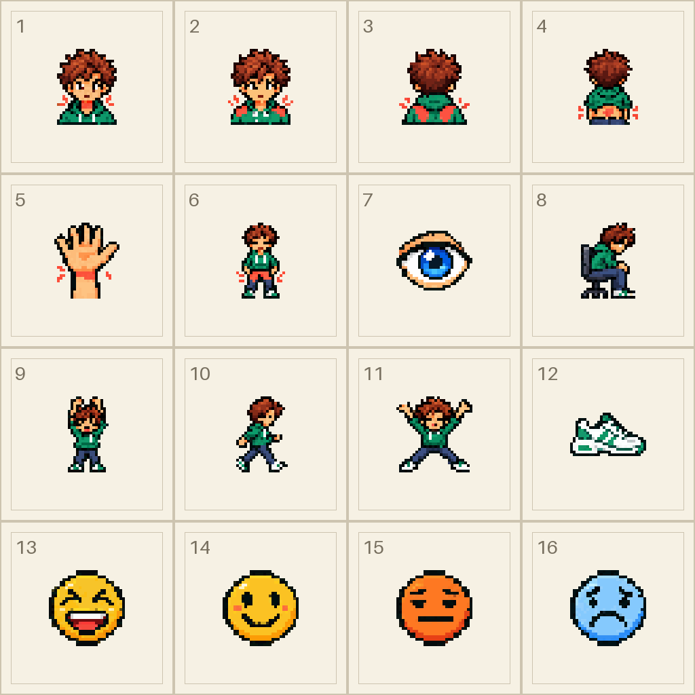
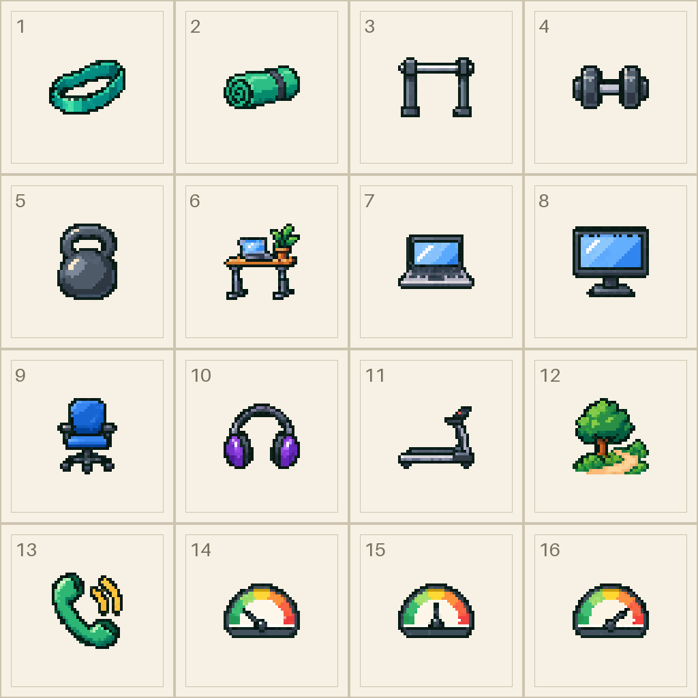
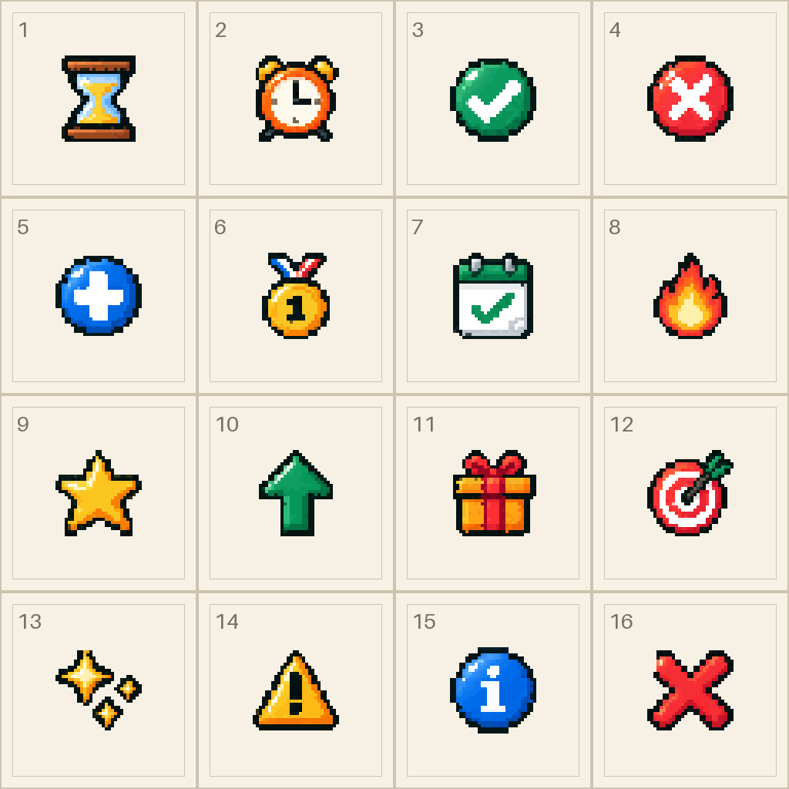
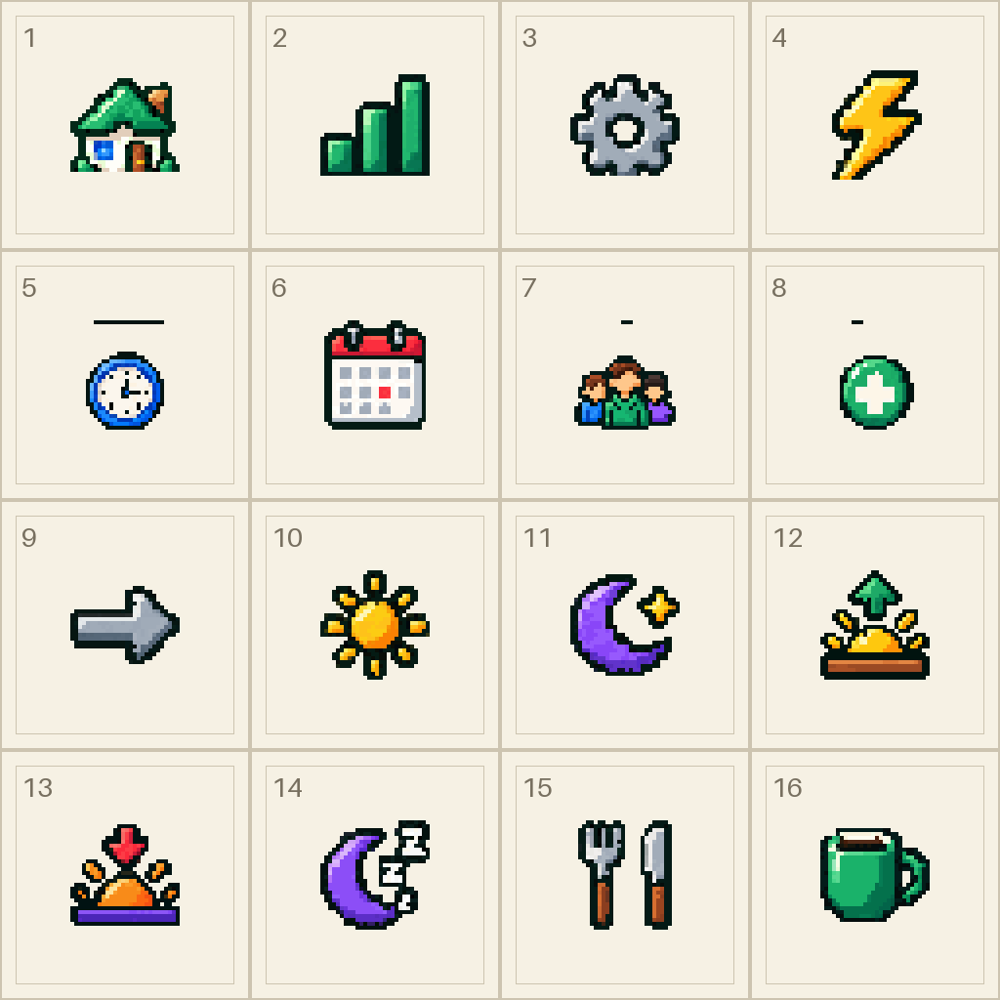
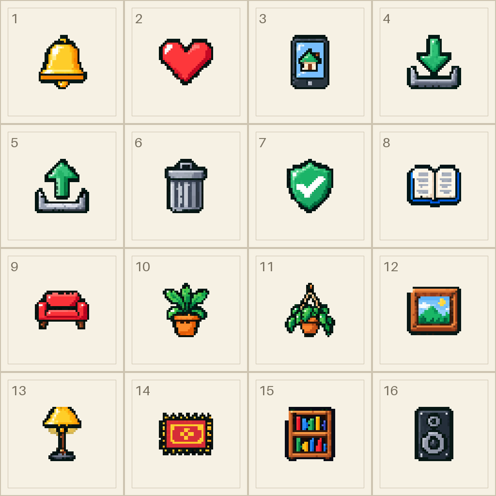
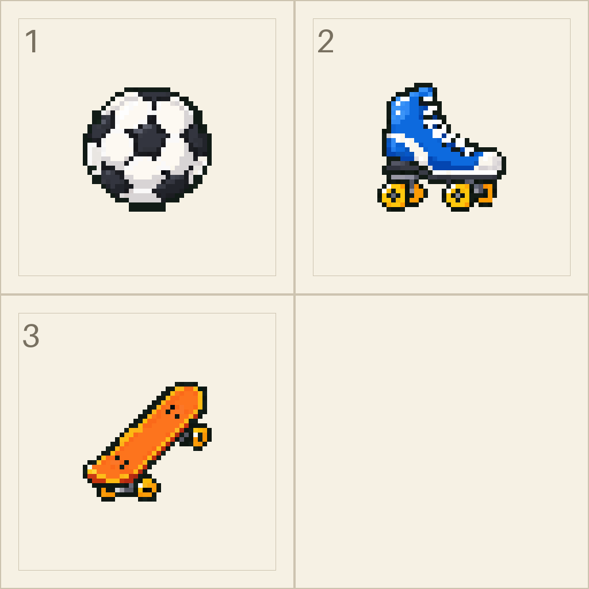

# Prompts para generar los iconos de Breakbit

<!-- Generado por scripts/pixel-icons/reference.py a partir de sheets.py. -->

83 iconos en 6 hojas, en el estilo de 16 bits del avatar. Son los que usa la app ahora mismo; los del pack original que no se usan no se piden.

## Qué adjuntar

Todo está en [docs/iconos/](iconos/):

- `estilo-avatar.png`: el avatar, como referencia de estilo. Se adjunta con el prompt maestro.
- Una referencia por hoja (`hoja-1-cuerpo.png`…): los iconos actuales en la celda que les toca, numerados. Se adjunta con el prompt de su hoja.

## Formato que necesito

- PNG de 1024×1024 con fondo transparente, una imagen por hoja, con el nombre exacto.
- Cuadrícula de 4×4 celdas de 256 px (la hoja 6 es de 2×2 celdas de 512 px).
- Cada icono es un sprite de 32×32 píxeles grandes y nítidos (bloques de 8×8 px; de 16×16 en la hoja 6), centrado en su celda y con 2 píxeles de margen.
- Da igual que la IA no clave la cuadrícula al píxel: al importarlos yo ajusto cada icono a su rejilla, quito restos de fondo, igualo la paleta y los centro.

## Cómo usarlos

1. Abre un chat nuevo en ChatGPT, adjunta `estilo-avatar.png` y pega el **prompt maestro**. Espera a que confirme.
2. Para cada hoja, adjunta su referencia y pega su prompt. Descarga la imagen con el nombre que indica.
3. Si un icono sale mal, pide repetir la hoja indicando el número de celda y qué corregir. Si solo falla uno, puedes pedir ese icono suelto en una imagen de 1024×1024 y decirme a qué icono corresponde.
4. Al final, pega el **prompt del zip** (si no puede, descarga las hojas una a una).

## Prompt maestro (con `estilo-avatar.png` adjunta)

```text
Vas a crear el set de iconos de Breakbit, una app que te ayuda a hacer pausas cortas para moverte durante la jornada de trabajo. Son 83 iconos repartidos en 6 hojas. Te adjunto «estilo-avatar.png»: es el avatar de la app, y los iconos tienen que parecer del mismo juego.

ESTILO (obligatorio en todos los iconos):
- Pixel art de 16 bits, como el avatar (estilo consola SNES/GBA): sombreado en 3 o 4 tonos por material, luz desde arriba a la izquierda, colores vivos pero suaves.
- Cada icono es un sprite de 32×32 píxeles. En la hoja, cada píxel del sprite es un bloque cuadrado (de 8×8 px en las hojas de 4×4 celdas): todos iguales y alineados, sin antialiasing, sin degradados, sin difuminados y sin textura de ruido.
- Contorno exterior de 1 píxel en verde muy oscuro, casi negro (#1D2B26), igual en todos los iconos.
- Siluetas grandes y claras: tienen que entenderse a 24 px de tamaño. Pocos detalles pequeños.
- Vista frontal o 3/4 ligera, coherente en todo el set.
- Paleta de la marca: verde bosque #2F6F46, verde #38A872, verde suave #6FAF8F, teal #2FB5A5, azul #3B82D6, azul polvo #7B9CCB, naranja #F4A261, dorado #FFCB3D, rojo #E5484D, crema #FFF8EE y grises neutros. El coral #FF5A3C se reserva para resaltar la zona del cuerpo en los iconos de zonas.
- «La persona» que aparece en algunos iconos es el chico del avatar en miniatura: pelo castaño alborotado, piel clara cálida, sudadera verde, vaquero oscuro y zapatillas blancas.

FORMATO DE CADA HOJA (obligatorio):
- PNG cuadrado de 1024×1024 con FONDO TRANSPARENTE de verdad.
- Una cuadrícula invisible de celdas iguales (4×4 celdas de 256×256 px, salvo que te diga otra): un icono por celda, en el orden que te indique, de izquierda a derecha y de arriba abajo.
- Cada icono centrado en su celda y ocupando como mucho 28×28 de sus 32×32 píxeles (2 píxeles de margen alrededor), sin tocar las celdas vecinas.
- Sin texto, sin números y sin letras (salvo las que forman parte del propio icono, como la «i» o el «1»). Sin líneas de cuadrícula, sin marcos, sin sombras en el suelo y sin halos alrededor.
- Con cada hoja te adjuntaré una referencia con los iconos actuales en su celda: es solo para que sepas qué va en cada sitio. No copies su estilo (son de 8 bits): rediséñalos en el estilo de 16 bits del avatar. Los números, las líneas y el fondo crema de la referencia NO se dibujan.

Te iré pidiendo las hojas una a una con su nombre de archivo. Respeta exactamente ese nombre. Confírmame que lo has entendido antes de empezar.
```

## Las hojas (de una en una, cada una con su referencia)

### hoja-1-cuerpo.png



```text
hoja-1-cuerpo.png — Cuerpo, movimiento y ánimo. Cuadrícula 4×4 (celdas de 256×256 px; cada píxel del sprite es un bloque de 8×8 px). Te adjunto la referencia con los iconos actuales en su sitio. Dibuja, de izquierda a derecha y de arriba abajo:
Fila 1:
1. Cuello: busto de frente de la persona, con el cuello resaltado en coral y dos marquitas de brillo coral a los lados.
2. Hombros: el mismo busto de frente, con los dos hombros resaltados en coral.
3. Espalda alta: el busto DE ESPALDAS (se ve el pelo, no la cara), con los omóplatos resaltados en coral a ambos lados de la columna.
4. Zona lumbar: la persona de espaldas, de cintura para arriba y con el inicio del pantalón; resaltada en coral la parte baja de la espalda, justo encima de la cintura.
Fila 2:
5. Muñecas y antebrazos: una mano abierta con la muñeca y el antebrazo; la muñeca resaltada en coral.
6. Cadera y piernas: la persona de cuerpo entero, de frente, con la cadera y los muslos resaltados en coral.
7. Vista: un ojo abierto grande, con el iris azul y un brillo.
8. Sentado: la persona de perfil, encorvada en una silla de oficina.
Fila 3:
9. Estiramiento: la persona de pie, de frente, estirando los dos brazos hacia arriba.
10. Caminar: la persona caminando de perfil, a buen paso.
11. Ejercicio: la persona saltando con brazos y piernas abiertos (salto de estrella).
12. Zapatilla deportiva: una zapatilla blanca de perfil con detalles verdes.
Fila 4:
13. Muy bien: carita amarilla redonda, muy feliz, ojos cerrados de alegría y boca abierta.
14. Bien: carita amarilla redonda sonriendo.
15. Cargado: carita naranja redonda, cansada, con la boca recta.
16. Bastante mal: carita azul clara redonda, triste.
Recuerda: PNG 1024×1024 con fondo transparente, un sprite de 32×32 por celda, contorno #1D2B26, sin texto, sin números de celda y sin cuadrícula.
```

### hoja-2-material.png



```text
hoja-2-material.png — Material, puesto de trabajo y ritmo. Cuadrícula 4×4 (celdas de 256×256 px; cada píxel del sprite es un bloque de 8×8 px). Te adjunto la referencia con los iconos actuales en su sitio. Dibuja, de izquierda a derecha y de arriba abajo:
Fila 1:
1. Banda elástica: una banda de resistencia en bucle, color teal, algo estirada.
2. Esterilla: una esterilla de yoga verde, medio enrollada.
3. Barra de dominadas: una barra horizontal metálica con sus dos soportes, vista de frente.
4. Mancuerna: una mancuerna gris oscuro, de lado.
Fila 2:
5. Kettlebell: una pesa rusa gris oscuro con su asa.
6. Escritorio elevable: un standing desk de madera con patas metálicas, un portátil encima y una planta pequeña.
7. Portátil: un portátil abierto con la pantalla azul clara.
8. Monitor: un monitor de ordenador con pantalla azul clara y su pie.
Fila 3:
9. Silla de oficina: azul, con ruedas.
10. Auriculares: unos auriculares de diadema, morados.
11. Cinta de correr: una cinta de andar de perfil.
12. Paseo por la calle: un árbol verde con un caminito delante.
Fila 4:
13. Llamada: un auricular de teléfono verde con ondas de sonido (reunión caminando).
14. Ritmo suave: un velocímetro semicircular, arco verde, amarillo y naranja de izquierda a derecha, con la aguja apuntando a la zona verde.
15. Ritmo normal: el mismo velocímetro con la aguja en el centro, hacia arriba.
16. Ritmo activo: el mismo velocímetro con la aguja apuntando a la zona naranja.
Recuerda: PNG 1024×1024 con fondo transparente, un sprite de 32×32 por celda, contorno #1D2B26, sin texto, sin números de celda y sin cuadrícula.
```

### hoja-3-estados.png



```text
hoja-3-estados.png — Estados de las pausas y recompensas. Cuadrícula 4×4 (celdas de 256×256 px; cada píxel del sprite es un bloque de 8×8 px). Te adjunto la referencia con los iconos actuales en su sitio. Dibuja, de izquierda a derecha y de arriba abajo:
Fila 1:
1. Pendiente: un reloj de arena con arena dorada.
2. Aplazada: un despertador naranja.
3. Hecha: un círculo verde con un check blanco.
4. Perdida: un círculo rojo con una X blanca.
Fila 2:
5. Pausa extra: un círculo azul con un "+" blanco.
6. A la primera: una medalla de oro con un "1" y su cinta.
7. Día bueno: una hoja de calendario con un check verde grande.
8. Racha: una llama de fuego naranja y amarilla.
Fila 3:
9. XP: una estrella dorada.
10. Subir de nivel: una flecha verde gruesa hacia arriba.
11. Premio: una caja de regalo naranja con lazo rojo.
12. Objetivo: una diana roja y blanca con una flecha clavada en el centro.
Fila 4:
13. Éxito: destellos dorados (una estrella de cuatro puntas grande y dos pequeñas).
14. Aviso: un triángulo amarillo con un signo de exclamación.
15. Información: un círculo azul con una "i" blanca.
16. Descartada: una X roja gruesa, sin círculo.
Recuerda: PNG 1024×1024 con fondo transparente, un sprite de 32×32 por celda, contorno #1D2B26, sin texto, sin números de celda y sin cuadrícula.
```

### hoja-4-jornada.png



```text
hoja-4-jornada.png — Navegación y jornada. Cuadrícula 4×4 (celdas de 256×256 px; cada píxel del sprite es un bloque de 8×8 px). Te adjunto la referencia con los iconos actuales en su sitio. Dibuja, de izquierda a derecha y de arriba abajo:
Fila 1:
1. Hoy (inicio): una casita con tejado verde y puerta.
2. Progreso: tres barras verdes crecientes, como un gráfico.
3. Ajustes: un engranaje gris.
4. Tengo un hueco: un rayo amarillo.
Fila 2:
5. Reloj: un reloj de pared redondo, borde azul, esfera blanca.
6. Calendario: una hoja de calendario con anillas rojas arriba y la cuadrícula de días.
7. Reunión: tres personas de busto, juntas (la del centro en verde).
8. Añadir: un círculo verde con un "+" blanco.
Fila 3:
9. Adelantar: una flecha gris gruesa hacia la derecha.
10. Sol: un sol amarillo con rayos.
11. Luna: una luna creciente morada con una estrellita.
12. Inicio de jornada: medio sol saliendo por el horizonte con una flecha verde hacia arriba.
Fila 4:
13. Fin de jornada: medio sol naranja poniéndose sobre un horizonte morado, con una flecha hacia abajo.
14. Descanso: una luna creciente morada con unas "z" de sueño.
15. Comida: un tenedor y un cuchillo, en vertical.
16. Taza: una taza verde de café.
Recuerda: PNG 1024×1024 con fondo transparente, un sprite de 32×32 por celda, contorno #1D2B26, sin texto, sin números de celda y sin cuadrícula.
```

### hoja-5-ajustes-habitacion.png



```text
hoja-5-ajustes-habitacion.png — Ajustes, datos y la habitación del avatar. Cuadrícula 4×4 (celdas de 256×256 px; cada píxel del sprite es un bloque de 8×8 px). Te adjunto la referencia con los iconos actuales en su sitio. Dibuja, de izquierda a derecha y de arriba abajo:
Fila 1:
1. Avisos: una campana dorada.
2. Corazón rojo (acerca de la app).
3. Instalar la app: un móvil con una casita en la pantalla.
4. Exportar: una flecha verde hacia abajo entrando en una bandeja.
Fila 2:
5. Importar: una flecha verde hacia arriba saliendo de una bandeja.
6. Borrar: una papelera gris con rayas verticales.
7. Proteger datos: un escudo verde con un check blanco.
8. Idioma: un libro abierto.
Fila 3:
9. Día libre: un sofá rojo.
10. Planta: una planta en una maceta naranja.
11. Planta colgante: una planta en una maceta colgada del techo, con hojas cayendo.
12. Cuadro: un cuadro con un paisaje (cielo azul, montañas verdes) y marco de madera.
Fila 4:
13. Lámpara: una lámpara de pie con pantalla amarilla.
14. Alfombra: una alfombra rectangular roja con un dibujo amarillo.
15. Estantería: una estantería de madera con libros de colores.
16. Altavoz: un altavoz gris oscuro con dos conos.
Recuerda: PNG 1024×1024 con fondo transparente, un sprite de 32×32 por celda, contorno #1D2B26, sin texto, sin números de celda y sin cuadrícula.
```

### hoja-6-ocio.png



```text
hoja-6-ocio.png — Ocio de la habitación. Cuadrícula 2×2 (celdas de 512×512 px; cada píxel del sprite es un bloque de 16×16 px). Te adjunto la referencia con los iconos actuales en su sitio. Dibuja, de izquierda a derecha y de arriba abajo:
Fila 1:
1. Balón: un balón de fútbol blanco y negro.
2. Patines: un patín de ruedas azul y blanco, de perfil.
Fila 2:
3. Monopatín: un monopatín naranja visto en diagonal, con sus ruedas.
La celda 4 queda vacía (transparente).
Recuerda: PNG 1024×1024 con fondo transparente, un sprite de 32×32 por celda, contorno #1D2B26, sin texto, sin números de celda y sin cuadrícula.
```

## Prompt del zip (al terminar)

```text
Mete las 6 hojas en un zip llamado breakbit-iconos.zip, con estos nombres exactos y en PNG con fondo transparente: hoja-1-cuerpo.png, hoja-2-material.png, hoja-3-estados.png, hoja-4-jornada.png, hoja-5-ajustes-habitacion.png, hoja-6-ocio.png. Antes de crearlo, comprueba que están todas, que ninguna tiene fondo y que no hay números ni líneas de cuadrícula.
```

## Comprobación

| Hoja | Iconos |
|---|---|
| `hoja-1-cuerpo.png` | neck, shoulders, upper_back, lower_back, wrist, hips, eyes, seated, stretch, walk, exercise, shoes, mood_great, mood_good, mood_loaded, mood_bad |
| `hoja-2-material.png` | resistance_band, mat, pullup_bar, dumbbell, kettlebell, desk, laptop, monitor, chair, headphones, treadmill, outside, call, pace_soft, pace_normal, pace_active |
| `hoja-3-estados.png` | pending, postponed, completed, missed, extra, first_try, good_day, streak, xp, level_up, reward, goal, success, warning, info, close |
| `hoja-4-jornada.png` | home, progress, settings, gap, clock, calendar, meeting, add, forward, sun, moon, sunrise, sunset, rest, food, mug |
| `hoja-5-ajustes-habitacion.png` | bell, heart, home_place, export, import, trash, shield, reading, sofa, plant, plant_decor, picture, lamp, rug, bookshelf, speaker |
| `hoja-6-ocio.png` | ball, skates, skate |

Cuando las tengas, déjalas en una carpeta (o el zip) y dime dónde están. Yo me encargo de recortar cada icono de su celda, ajustarlo a su rejilla de 32×32, limpiar el fondo, igualar paleta y encuadre y cambiarlos en la app.
